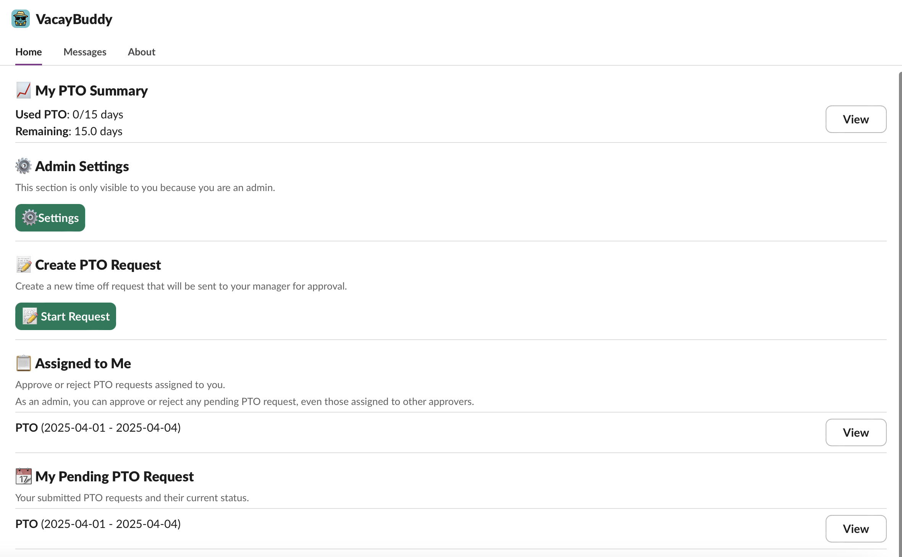
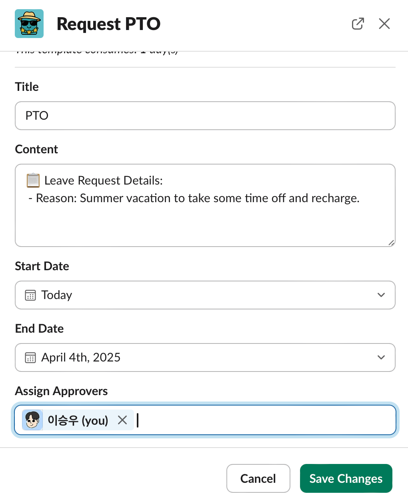
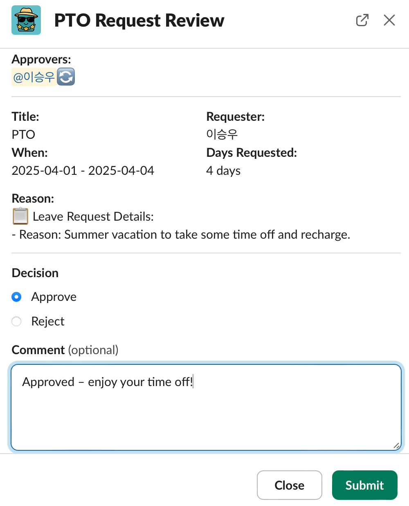

# VacayBuddy - Simplify PTO in Slack


VacayBuddy is a Slack app that allows you to easily request, approve, and manage Paid Time Off (PTO) directly within Slack.

## Key Features

- **Home Tab Dashboard**: View your PTO summary, create requests, and see assigned approvals in one place
  
- **PTO Requests**:  Easily submit new PTO requests directly from the Home tab
  
- **Approval Workflow**: Review and respond to PTO requests assigned to you without leaving Slack
  
- **Admin Functions**: Administrators can review all PTO requests and manage organization settings

## Installation

### Create a Slack App

1. Go to [https://api.slack.com/apps/new](https://api.slack.com/apps/new) and select "From an app manifest"
2. Choose the workspace where you want to install the app
3. Copy the contents of `manifest.json` into the text box and click "Next"
4. Review the configuration and click "Create"
5. Click "Install to Workspace" and select "Allow"

### Environment Variables

1. Copy `env.sample` to `.env`
2. Go to your [app settings page](https://api.slack.com/apps), click "OAuth & Permissions" and copy the Bot User OAuth Token to `SLACK_BOT_TOKEN` in your `.env` file
3. In "Basic Information", follow the instructions in the "App-Level Tokens" section to create a token with the `connections:write` scope and add it to `.env` as `SLACK_APP_TOKEN`
4. Configure additional environment variables for database connections as needed

### Install Dependencies and Run

```
npm install
npm start
```

## Project Structure

- **`src/app.ts`**: Application entry point
- **`src/middleware.ts`**: Middleware including app context loading
- **`src/listeners/`**: Handlers for Slack events, actions, and commands
- **`src/entity/`**: Data models for users, organizations, and PTO requests
- **`src/service/`**: Services for business logic processing

## Usage

1. Install the app to your Slack workspace
2. Use the "Start Request" button in the app home tab to create PTO requests
3. Approvers can review and approve/reject assigned requests
4. Users can check their PTO summary and request status

## Admin Features

Administrators have access to:
- Review, approve, or reject all PTO requests
- Configure organization PTO policies
- Manage user vacation days

## Developer Information

This app is built using TypeScript and Slack's Bolt framework. Node.js and npm are required for development.

## Contact

For PTO-related inquiries, please contact letnaturebe2@gmail.com