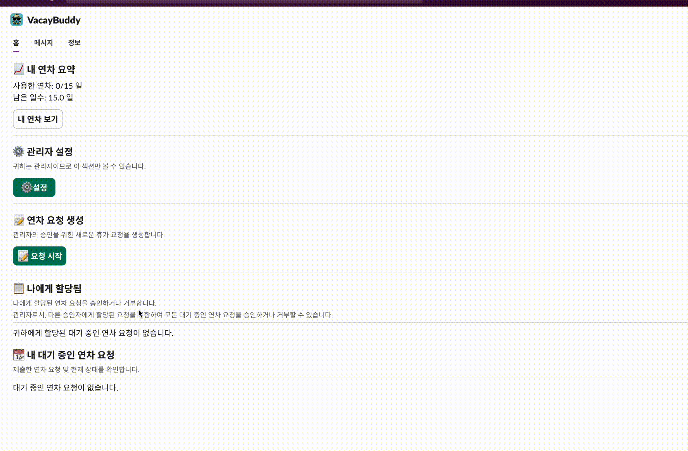
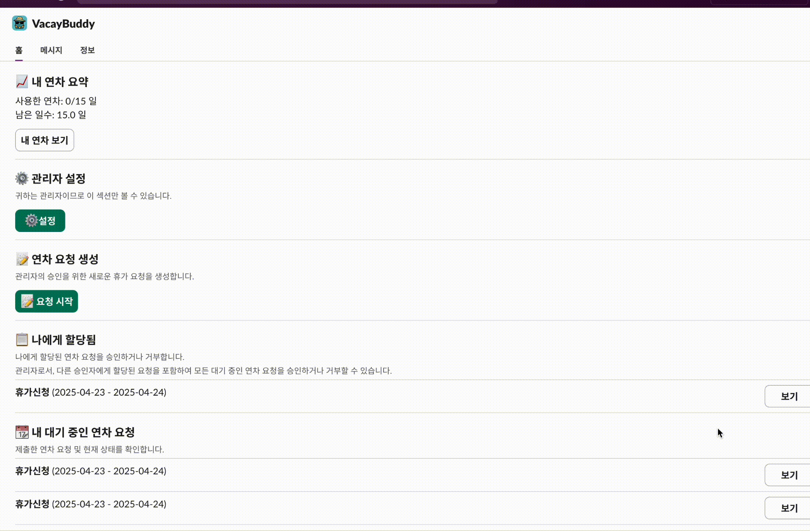

# 연차관리 슬랙으로 쉽게!

####  VacayBuddy는 연차 신청부터 승인, 현황 확인까지 전부 슬랙 안에서 해결할 수 있는 스마트한 연차 관리 도우미입니다.<a href="https://vacaybuddy-server-1080165942907.asia-northeast3.run.app//slack/install">

<div> 
설치하기 
<a href="https://vacaybuddy-server-1080165942907.asia-northeast3.run.app//slack/install">

</a>
</div>

## 간편한 연차 신청



- **슬랙에서 바로 신청**: 슬랙 앱 홈에서 몇 번의 클릭으로 간편하게 연차를 신청하세요.
- **남은 연차 확인**: 봇 설치 후 홈탭에서 바로 내 남은 연차를 한눈에 확인할 수 있습니다.
- **이전 연차 내역**: 신청한 연차 내역을 상세히 확인할 수 있습니다.

## 편리한 승인 및 검토



- **알림 및 승인**: 연차 신청 시 메시지 알림이 오고, 버튼을 눌러 모달창에서 승인 또는 거절할 수 있습니다.
- **간편한 승인 처리**: 슬랙 메시지나 홈탭에서 바로 모달창을 열어 승인 또는 거절할 수 있습니다.

## 관리자 기능


- **맞춤형 휴가 템플릿 관리**: 연차, 오후반차, 포상휴가 등 다양한 휴가 유형을 자유롭게 설정하고 관리할 수 있습니다.
- **팀원 휴가 관리 대시보드**: 모든 팀원의 휴가 신청 내역과 남은 연차를 한 눈에 확인하고 관리할 수 있습니다.

## 스마트한 연차 데이터 관리


- **엑셀 데이터 연동**: 기존 엑셀 파일로 관리하던 팀원들의 연차 데이터를 한 번에 업로드하여 자동으로 동기화합니다.
- **원활한 연차 전환**: 기존 시스템에서 VacayBuddy로 손쉽게 마이그레이션하여 연차 관리 시스템 전환이 가능합니다.


## 설치 방법

### Slack 앱 생성하기

1. [https://api.slack.com/apps/new](https://api.slack.com/apps/new)로 이동하여 "From an app manifest" 선택
2. 앱을 설치할 워크스페이스 선택
3. `manifest.json` 내용을 텍스트 상자에 복사하고 "Next" 클릭
4. 구성을 검토하고 "Create" 클릭
5. "Install to Workspace"를 클릭하고 "Allow" 선택

### 환경 변수 설정

1. `env.sample`을 `.env`로 복사
2. 다음과 같이 환경 변수를 구성합니다:

```
# Socket Mode 설정 (Socket Mode 사용 시 필수)
SLACK_BOT_TOKEN=xoxb-ababa
SLACK_APP_TOKEN=xapp-1abab

# HTTP Mode 설정 (HTTP Mode 사용 시 필수)
SLACK_SIGNING_SECRET=...
SLACK_CLIENT_ID=...
SLACK_CLIENT_SECRET=...
SLACK_STATE_SECRET=...

# Slack OAuth Scopes
SLACK_SCOPES=files:read,im:history,im:write,users:read,users:read.email,chat:write,chat:write.public,channels:read

# 애플리케이션 설정
APP_URL=...  # HTTP Mode 사용 시 필요, 로컬 개발 환경에서는 ngrok 주소 입력
JWT_SECRET=JWT_SECRET

# 데이터베이스 설정 (기본값: SQLite)
# 기본적으로 SQLite를 사용하며, 별도 설정 없이 로컬에서 실행 가능합니다.
# MySQL을 사용하려면 다음 설정의 주석을 제거하고 값을 입력하세요 (선택사항)
#DB_TYPE=mysql
#DB_HOST=
#DB_PORT=3306
#DB_USERNAME=
#DB_PASSWORD=
#DB_DATABASE=
#DB_SYNC=true
#DB_LOGGING=false
```

3. [앱 설정 페이지](https://api.slack.com/apps)에서 필요한 토큰과 시크릿을 확인하여 입력합니다.
4. 기본적으로 SQLite 데이터베이스를 사용하므로 별도의 데이터베이스 설정 없이 바로 실행할 수 있습니다.

### 로컬 실행 방법

VacayBuddy는 두 가지 모드로 실행할 수 있습니다:

#### 1. Socket Mode (개발용)
로컬 개발 환경에서 터널링 없이 Slack과 통신할 수 있습니다. 초기 개발 단계에서 권장됩니다.
필수 환경 변수: `SLACK_BOT_TOKEN`, `SLACK_APP_TOKEN`

```bash
npm install
npm run dev-socket
```

#### 2. HTTP Mode (프로덕션용)
실제 프로덕션 환경과 동일한 방식으로 HTTP 엔드포인트를 통해 Slack과 통신합니다.
필수 환경 변수: `SLACK_SIGNING_SECRET`, `SLACK_CLIENT_ID`, `SLACK_CLIENT_SECRET`, `SLACK_STATE_SECRET`, `APP_URL`

HTTP Mode를 로컬에서 테스트하려면:
1. [ngrok](https://ngrok.com/)을 설치하고 `ngrok http 3000` 명령으로 터널을 생성
2. 생성된 ngrok URL을 `.env` 파일의 `APP_URL`에 설정
3. Slack 앱 설정의 Redirect URLs와 Event Subscriptions URL도 ngrok URL로 업데이트

```bash
npm install
npm run dev-http
```

#### 프로덕션 배포
```bash
npm start
```

## 슬랙 커뮤니티
슬랙 채널에서 궁금한 점이나 피드백을 남겨주세요. 여러분의 의견을 기다립니다!
[채널 참여하기](https://join.slack.com/t/vacay-buddy/shared_invite/zt-328y00o5z-HoneR_Gl4iNlg9sNMMgrNg)

## LICENSE
MIT 라이센스에 따라 배포됩니다. 자세한 내용은 [LICENSE](LICENSE) 파일을 참조하세요.

## 연락처
PTO 관련 문의는 letnaturebe2@gmail.com으로 연락하세요.